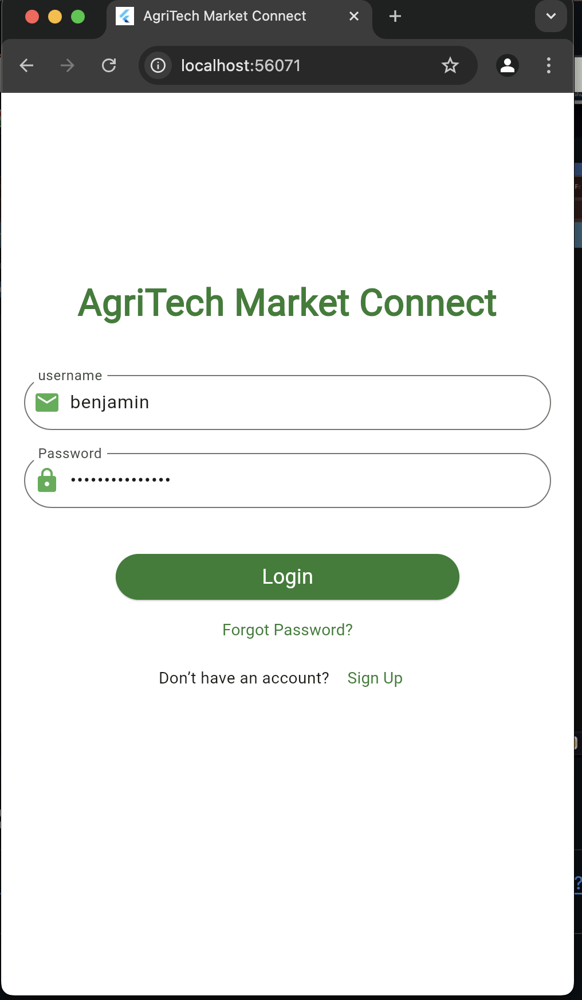
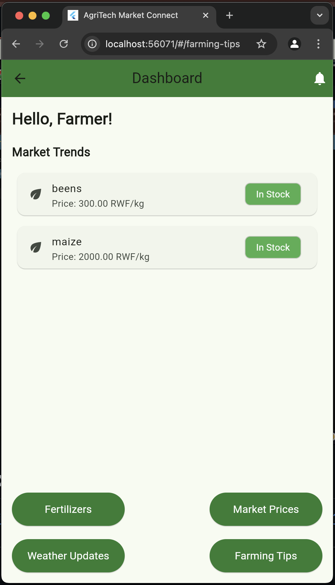
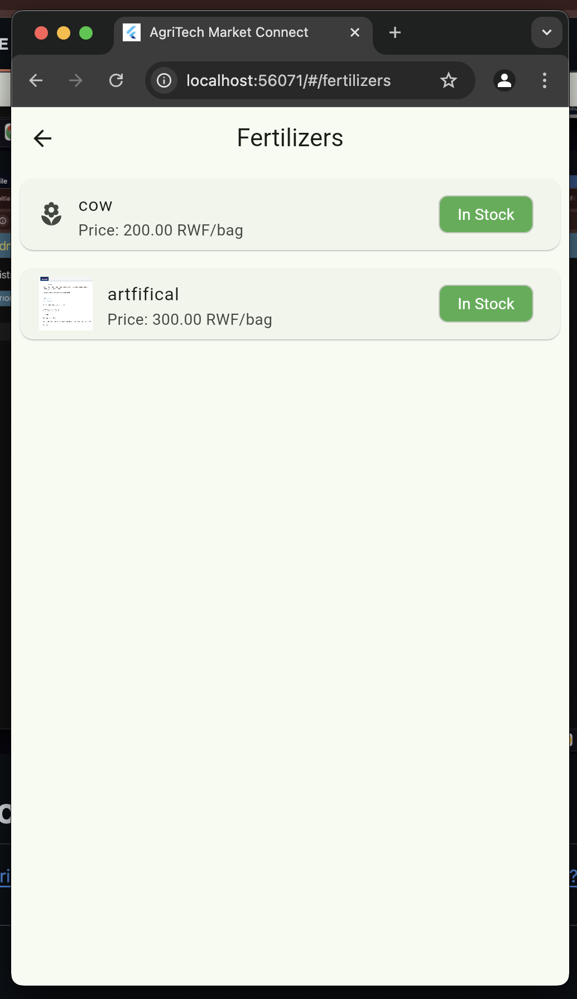
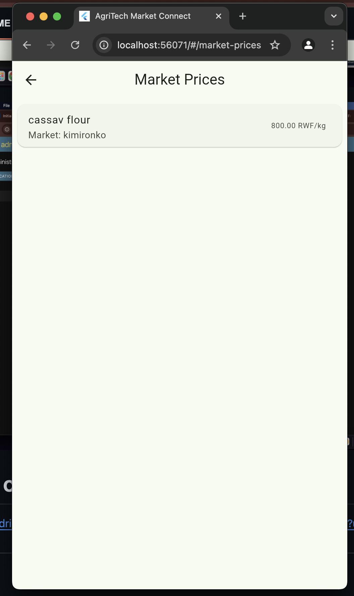

# AgriTech Market Connect

AgriTech Market Connect is a mobile application designed to empower smallholder farmers in Rwanda by providing real-time, localized market pricing and trend information. This user-centered solution aims to improve market access, enhance agricultural productivity, and create a more efficient market network for farmers.

## Key Features

- **Real-time Market Pricing**: Provides farmers with up-to-date pricing information for various crops in their area.
- **Weather Forecasting**: Integrates weather updates to help farmers make better decisions regarding their crops.
- **Offline Functionality**: Works in areas with limited internet connectivity, enabling farmers to access crucial market and weather data.
- **User-Centered Design**: Designed to be intuitive and easy to use, especially for farmers with limited technical experience.
- **Location-Based Data**: Displays localized market data and trends based on the farmer’s location.
- **User Authentication**: Farmers can register, log in, and personalize their experience.
  
## Technologies Used

- **Flutter**: Cross-platform mobile development framework used for building the app.
- **Firebase**: Cloud platform for real-time database, user authentication, and storage.
- **OpenWeather API**: Provides weather information to integrate real-time weather updates into the app.
- **Google Maps API**: Used for location-based services to provide localized market data.
- **Dart**: Programming language used for developing the mobile application.

## Installation Instructions

To run the AgriTech app locally, follow the steps below:

### Prerequisites

- Install **Flutter SDK**: [Get started with Flutter](https://flutter.dev/docs/get-started/install)
- Install **Android Studio** or **Visual Studio Code** for development.

- **Back-end**
  - Python 3.9+  
  - Django 4.x  
  - PostgreSQL  
  - Virtualenv  
  - Gunicorn  

- **Mobile App**
  - Flutter SDK 3.x  
  - Android Studio / Xcode  


## Back-End Setup (Django)

### Steps to Run the App

1. **Clone the repository**:
   ```bash
   git clone https://github.com/your-username/agritech-market-connect.git
   cd agritech_market_connect/server


 2. **Create a Virtual Environment**:
```bash
python3 -m venv venv
source venv/bin/activate  # Use `venv\Scripts\activate` on Windows
```

 3. **Install Dependencies**:
```bash
pip install -r requirements.txt
```
 4. **Run Migrations**:
```bash
python manage.py makemigrations
python manage.py migrate
```

### 5. Start the Server
```bash
python manage.py runserver
``` 
------

## Mobile App setup (Flutter)

### 1. Install dependencies
```bash
python manage.py runserver
```

### 2. Run the app
```bash
flutter run
```


# Deployment Plan
## Back-End Deployment
Set Up the Server

Use a cloud platform (e.g., AWS, DigitalOcean, or Heroku).
Install Docker or Python on the server.
Deploy Django Back-End

Use Gunicorn and Nginx for deployment.
Steps:
```bash
pip install gunicorn
gunicorn --bind 0.0.0.0:8000 projectname.wsgi
```
Configure Nginx to proxy requests to Gunicorn.
Use HTTPS

Use Let's Encrypt for free SSL certificates:
```bash
sudo certbot --nginx
```
Environment Variables

Use .env files or export variables for sensitive configurations like database credentials.

## Mobile App Deployment
Generate Build

For Android:
```bash
flutter build apk
```
For iOS:
```bash
flutter build ios
```

Distribute App

Android: Publish the APK on the Google Play Store.
iOS: Submit the app to the Apple App Store.
API Endpoint Configuration

Ensure the mobile app points to the live Django back-end URL in the API_BASE_URL variable.

# Figma Mockup design
   
   https://www.figma.com/design/xjosTIyfVs7IhzaemBDlQn/Agritech?node-id=0-1&t=CKKY1BC7zReGh4w2-1


# screenshots of the app interfaces







# link of video (Demo)

https://drive.google.com/file/d/14qTMqmnZcSoAArm7L1z9h39jgsqAQcEH/view?usp=sharing

